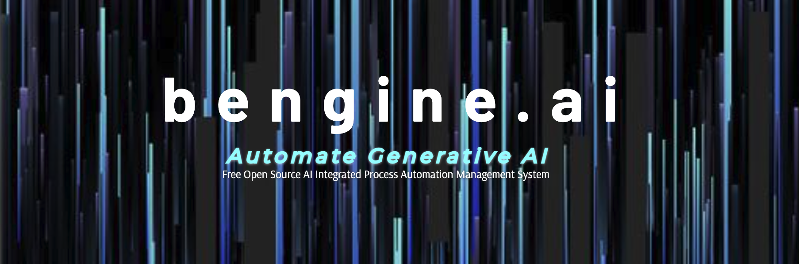

# B Engine 🌟

Integrated Process Automation Management System 🤖

> Manage automated, complex, large scale, time heavy, LLM driven, integrated processes, in a simple no code workflow environment. 🚀
> 
> Enjoy scalable, repeatable, world-class quality, generative AI powered document creation and integrated general purpose task execution. 📝
> 
> Create project outlines, fully working codebases, complete text documents in long form, one-time scripts, refactored files and more. 💻
> 
> High degree of LTS compatibility with efficient modular codebase architecture allows for self-improving systems operation. 🛠️

## Quick Links 🌐

- [Releases](#releases) 📦
- [Documentation](bengine.ai/docs) 📚
- [Homepage](bengine.ai) 🏠
- [Consulting and Support](deepwizards.com/bengine) 💼

## Table of Contents 📑

1. [Installation](#installation) 💾
2. [Usage](#usage) 🛠️
3. [Features](#features) 🌈
    - [Block and Template](#block-and-template) 📦
    - [Jobs](#jobs) 📋
    - [Projects](#projects) 🗂️
    - [Flows](#flows) 🌊
    - [Data](#data) 📊
    - [Outputs](#outputs) 📈
4. [Modules and Services](#modules-and-services) 🧩
5. [Contributing](#contributing) 🤝
6. [License](#license) 📝

---

## Installation 💾

1. Clone the repository:
   `git clone https://github.com/yourusername/bengine.git`
   
2. Navigate to the project directory:
   `cd bengine`
   
3. Install dependencies:
   `npm install`

4. Copy `.env.example` to `.env` and update with real values:
   `cp .env.example .env`

## Usage 🛠️

### Docker Compose 🐳

1. Build the Docker image:
   `docker build -t bengine .`

2. Run Docker Compose:
   `docker-compose up`

### Node.js 🟢

1. Ensure MongoDB is running.

2. Navigate to `/main` directory:
   `cd main`

3. Run the application:
   `node app.js`

#### Services 🌐

- Run services using Docker Compose in `/services`:
  `docker-compose -f /services/docker-compose.yml up`

- Or run individual services in `/services`.

## Features 🌈

### Block and Template 📦

Blocks are the fundamental units of work in Bengine. Designed to be repeatable and reusable, they come with space for variables loaded via Data. Templates serve as blueprints for Blocks, specifying the service endpoint for interaction.

- 🔄 Repeatable and reusable Blocks
- 🎯 Templates specify service endpoints

### Jobs 📋

Jobs are the actionable units in Bengine. They come with various statuses like open, pending, blocked, and completed. Each job is associated with a Flow ID and interacts with models such as Block, Data, and Output.

- 📊 Various statuses (open, pending, blocked, completed)
- 🤝 Associated with a Flow ID

### Projects 🗂️

Projects manage the execution of Flows. When active, Jobs are created from the defined Flows, Blocks, and Data. The Flows dictate the sequence of Jobs sent to the service API, and Outputs and statuses are received back. A project-level output is saved upon completion of all Flows.

- 🗂️ Manage execution of Flows
- 📈 Save project-level Outputs

### Flows 🌊

Flows are sequences of Blocks with basic process flow logic. They define the Data required for Blocks. When triggered, Blocks and Data are used to create Jobs. Each Flow culminates in an Output.

- 🌊 Collections of Blocks with process flow logic
- 📈 Culminate in an Output

### Data 📊

Data is the specific information required for Blocks. Set at the project level, this data is collected via a service API and used to populate variables within a Block or Template.

- 📊 Specific information for Block completion
- 🌐 Collected via service API

### Outputs 📈

Outputs are the result data from Jobs. Stored for later access, they can be used for analysis or further processing. Both Projects and Flows save specific Outputs.

- 📈 Result data from Jobs
- 🗂️ Saved at both the Project and Flow levels

---

## Modules and Services 🧩

### Modules 📦

Modules are located in `/main/modules` and consist of Node.js and Pug code. They extend the functionality of B Engine.

### Services 🌐

Services are located in `/services` and can be any API. They provide additional capabilities and can be integrated into the workflow.

---

## Contributing 🤝

We welcome contributions from the community. Please read our [Contributing Guide](CONTRIBUTING.md) for more information on how to get involved.

## License 📝

This project is licensed under the GNU General Public License v3. See the [LICENSE](LICENSE.md) file for details.
